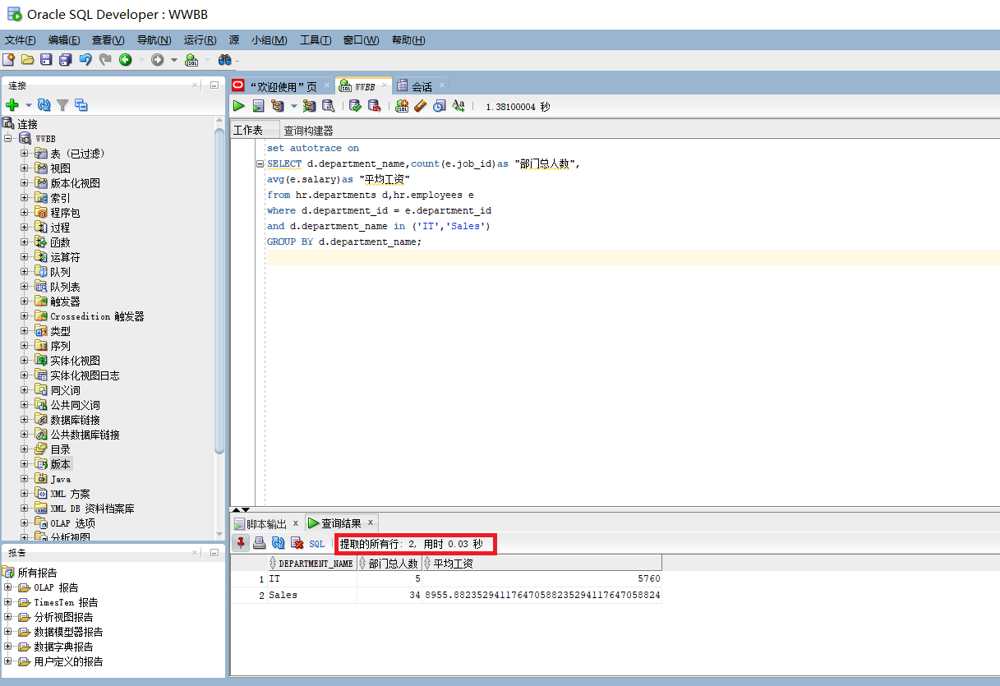
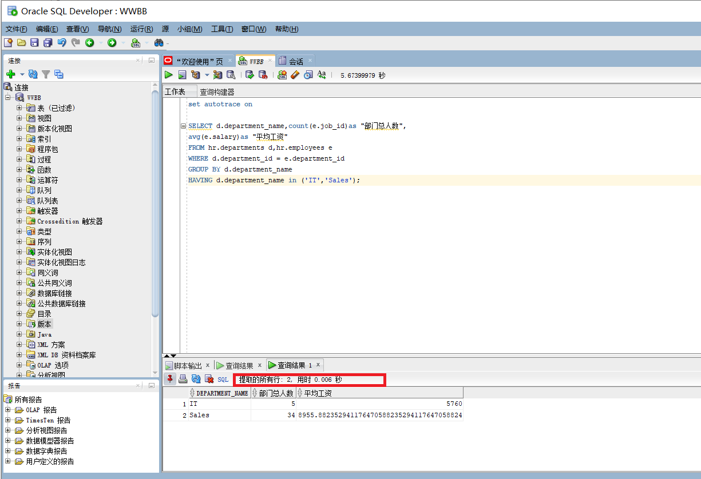

# Test1:SQL语句的执行计划分析与优化指导

汪斌  201810414217  2班

## 实验目的

分析SQL执行计划,执行SQL语句的优化指导。理解分析SQL语句的执行计划的重要作用。

## 实验内容

- 对Oracle12c中的HR人力资源管理系统中的表进行查询与分析。

- 首先运行和分析教材中的样例：本训练任务目的是查询两个部门('IT'和'Sales')的部门总人数和平均工资，以下两个查询的结果是一样的。但效率不相同。

- 设计自己的查询语句，并作相应的分析，查询语句不能太简单。

  ## 教材中的查询语句

- 查询1：

```sql
set autotrace on

SELECT d.department_name,count(e.job_id)as "部门总人数",
avg(e.salary)as "平均工资"
from hr.departments d,hr.employees e
where d.department_id = e.department_id
and d.department_name in ('IT','Sales')
GROUP BY d.department_name;
```

分析：先通过where选出符合条件的语句，再通过group by 分组，最后通过聚合函数统计人数、计算平均工资。

截图：



- 查询2

```sql
set autotrace on

SELECT d.department_name,count(e.job_id)as "部门总人数",
avg(e.salary)as "平均工资"
FROM hr.departments d,hr.employees e
WHERE d.department_id = e.department_id
GROUP BY d.department_name
HAVING d.department_name in ('IT','Sales');
```

分析：先通过where筛选（但是没有判断），然后使用group by 分组，对每个分组筛选，最后通过聚合函数统计人数，计算平均工资。

截图：




## 实验结论

使用SQL Developer工具，可以对比查询速度；通过上述实验可知：查询方法1使用时间0.03秒，查询方法2使用时间0.006秒；可知查询方法2速度更快。


## 设计

```
set autotrace on

select d.department_name, count(*) as "部门总人数",
avg(e.salary) as "平均工资"
from hr.departments d, hr.employees e
where d.department_id = e.department_id
GROUP BY d.department_name
HAVING d.department_name in ('IT','Sales');
```

分析：直接统计全部人数。