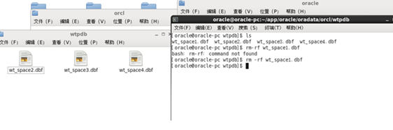

# 学生档案管理数据库设计

## 1.设计概述

## 1.1设计背景

学生档案管理是所有大、中、小学均需要进行的- -项任务繁重的工作。尤其近几年随着国家深化教育体制改革，学校进行大量扩招，学生的档案管理变的更为重要。做好学生档案管理是一个学校最基本的工作，是-一个教育单位必须要有的部分。它对学校的管理者来说非常重要，学生档案如果不清晰，那么学校将会变得混乱不堪。
另外，学生的基本信息也是-项很重要的信息，如果管理不好，被不法分子利用，后果将不堪设想。传统的学生档案管理为人工管理，采用纸质档案的方式。那个时代学生信息量小，所以依靠人力可以基本完成。随着时代的发展，现在的学校动辄几千甚至几万人，再加上已经毕业的存档历史记录，是的数据量急剧增加，单纯依靠人力已经无法变得十分困难。比如说，查询学生成绩就是一项很繁琐的工作。
  就目前来说，如果仅仅依靠人工来管理学生档案信息，必然会出现各种问题，导致工作效率极其低下，工作失误率高。另外，以人工的方式来管理学生档案信息，还会带来不安全因素。这必然会给教育单位带来不必要的麻烦，使得学校的声誉及教学质量下降。针对上述问题，我们有必要进行改革。这就使得使用计算机来对学生档案信息进行管理变得非常有必要。基于数据库管理系统的计算机能够实现高效的管理大量的数据。
对不同用户提供不同的功能，大大提高了数据的安全性。- -个好的学生档案管理系统，能够让学校管理者简化大量的工作，从而节省大量人力物力，让教育单位的决策者和管理者有更多的精力放在学校教育质量上，大大的促进了学校的发展。

## 1.2设计内容

本系统在对学生档案管理的实际需求和不同用户的任务不同进行了详细分析的基础_上,采用功能强大且是目前最流行之一的大型关系数据库0racle数据库管理系统，设计并实现了学生档案管理系统。由于不同类型的用户需要做的工作不同，比如一个教育单位的顶层管理者要总览全局，对学校各院系进行管理，而院系相关负责人又需要对本院系的师生的档案信息进行管理等。因此我们设计的系统进行了分模块处理，不同的用户对应不同的模块，具体介绍如下:

(1) 管理员模块:学校管理者(管理员用户)可以对院系信息进行管理，对学生的奖惩、学籍变动信息进行管理等;

(2)院系模块: 院系负责人(院系用户)可以管理本院系的师生基本信息、课程信息等;

(3)教师模块: 教师用户可以查询自己的授课信息并且为自己所教授的学生进行成绩管理等;

(3)学生模块:学生用户可以查询自己的选课信息和成绩信息，以及查看个人奖惩信息和学籍变动信息等。

本次数据库设计只实现部分模块，并不是一个非常完整的数据库系统设计

## 第2章业务流程

E-R 图

  

                    
## 第3章实体模型

根据业务流程分析，一共有5个实体，分别为：院系，学生，老师，班级，课程。

院系:院系有院系编号、院系名称、办公地点、联系电话、登录密码以及备注
                                                    

学生:学生有学生编号、姓名、性别、院系、班级、联系电话
                                                     

 班级:班级有班级编号、班级名称、院系、班主任、班长以及备注等属
                                                     

教师:教师有教师编号、姓名、性别、入职日期、院系、职份
                                                    

课程:课程有课程编号、课程名、课程性质、归属院系、学分、教材
                                                    

关系模型为：
院系信息(院系编号，院系名称，办公地点，联系电话，备注，登录密码)
学生信息(学生编号，姓名，性别，院系，班级，联系电话)
教师信息(教师编号，姓名，性别，入职日期，院系，职份）
班级信息(班级编号，班级名称，院系，班主任，班长，备注)
课程信息(课程编号，课程名，学分，课程性质，教材，院系)

## 第4章数据库表设计

根据业务流程分析，一共有5张表，分别为：院系表，学生表，老师表，班级表，课程表。

（1）院系表
院系表（department）
属性名	数据类型	说明
d_no	Varchar2(20)	院系编号
d_name	Varchar2(20)	院系名称
d_aar	Varchar2(30)	办公地点
d_phone	Varchar2(15)	联系电话
d_note	Varchar2(200)	备注
userpw	Varchar2(20)	登录密码

说明:本表用来存储院系的基本信息。主键: dno。 该表中dno、danme 和
userpw属性不允许为空值。
以下的学生信息表、教师信息表中的该字段与此相同，不再重复说明。
 （2）学生信息表
  学生信息表（student）
属性名	数据类型	说明
s_no	Varchar2(20)	学生编号
s_name	Varchar2(20)	姓名
s_sex	Number	性别
s_dept	Varchar2(20)	院系
s_cg	Varchar2(20)	班级
s_phone	Varchar2(15)	联系电话

说明:本表用来存储学生的基本信息。主键：s_no外键 ：s_dept(引用院系信息 d_no) s_cg(引用班级信息表中的cg_no)
该表中s_no，s_name，s_sex，s_dept，s_cg  不允许为空
（3）教师信息表
教师信息表（teacher）
属性名	数据类型	说明
t_no	Varchar2(20)	教师编号
t_name	Varchar2(20)	姓名
t_sex	Number	性别
t_esd	Varchar2(12)	入职日期
t_dept	Varchar2(20)	院系
t_title	Varchar2(50)	职份

说明:本表用来存储教师的基本信息。主键：t_no外键 ：t_dept(引用院系信息 d_no)
该表中t_no，t_name，t_sex，t_dept，t_esd  不允许为空
 (4)班级信息表
    班级信息表（classandgrade）
属性名	数据类型	说明
cg_no	Varchar2(20)	班级编号
cg_name	Varchar2(30)	班级名称
cg_dept	Varchar2(20)	院系
cg_headt	Varchar2(20)	班主任
cg_monitor	Varchar2(20)	班长
cg_note	Varchar2(200)	备注

说明:本表用来存储班级的基本信息。主键：cg_no外键 ：cg_dept(引用院系信息 d_no)，cg_headt(引用教师信息表中的t_no)，cg_monitor(引用学生信息表中的s_no)
该表中cg_no，cg_name，cg_dept  不允许为空
 （5）课程信息表
课程信息表（course）
属性名	数据类型	说明
c_no	Varchar2(20)	课程编号
c_name	Varchar2(30)	课程名
c_credit	Number	学分
c_book	Varchar2(20)	教材
c_type	Varchar2(20)	课程性质
c_dept	Varchar2(20)	院系

说明:本表用来存储课程的基本信息。主键：c_no外键 ：c_dept(引用院系信息 d_no)
该表中c_no，c_name，c_dept  c_type c_credit     不允许为空

 

## 第5章创建pdb数据库，表空间，表，以及用户

5.1 创建pdb数据库以及管理员

创建wtpdb数据库，指定了它的存储位置，以及创建了数据库的管理员wt，具体sql如下

create pluggable database wtpdb admin user wt identified by 123 file_name_convert=('/home/oracle/app/oracle/oradata/orcl/bseed/',' /home/oracle/app/oracle/oradata/orcl/wtpdb');|

通过sys给wt授权并新建数据库连接wtpdb

​                                                 

                                                

5.2 创建表空间
在wtpdb数据库中创建了表空间wt_space1，表空间wt_space2,表空间wt_space3,表空间wt_space4 sql语句如下：
create tablespace 
wt_space1
datafile '/home/oracle/app/oracle/oradata/orcl/wtpdb/wt_space1.dbf' 
size 150M 
autoextend on next 50m
maxsize unlimited;

​                                             

​                                                         

5.3 创建表以及将teacher表进行分区
1创建学生表
create table student (
    s_no Varchar2(20) not null primary key,
    s_name Varchar2(20) not null,
    s_sex Number not null,
    s_dept Varchar2(20) not null,
    s_cg Varchar2(20)  not null,
    s_phone Varchar2(15)
)TABLESPACE wt_space1;

  

2创建班级表
create table classandgrade (
    cg_no Varchar2(20) not null primary key,
    cg_name Varchar2(30) not null,
    cg_dept Varchar2(20) not null,
    cg_headt Varchar2(20) ,
    cg_monitor Varchar2(20),
    cg_note  Varchar2(200)
)TABLESPACE wt_space1;

3 创建课程表
create table course (
    c_no Varchar2(20) not null primary key,
    c_name Varchar2(30) not null,
    c_dept Varchar2(20) not null,
    c_type Varchar2(20)  not null,
    c_book Varchar2(20),
    c_credit  number  not null
)TABLESPACE wt_space1;

​    

4 创建院系表
create table department (
    d_no Varchar2(20) not null primary key,
    d_name Varchar2(20) not null,
    d_aar Varchar2(30) ,
    d_phone Varchar2(15),
    d_note Varchar2(20),
    userpw Varchar2(20)  not null
)TABLESPACE wt_space1;

​     此处为分区操作
5 创建老师表将老师的入职时间（t_esd），进行分区，分别将2018年之前的数据放在表空间w't_space1, 将2019 到 2018年的数据放在了表空间wt_space2，将2020年 到 2019年的数据放在了表空间wt_space3,最后将大于2020年的数据放在了wt_spcae4里面。
create table teacher (
    t_no Varchar2(20) not null primary key,
    t_name Varchar2(20) not null,
    t_sex number  not null,
    t_esd Varchar2(12)  not null,
    t_dept Varchar2(20)  not null,
    t_title Varchar2(50)  
) partition by range (t_esd)
(
partition p1 values LESS THAN (TO_DATE(' 2018-01-01 00:00:00', 'SYYYY-MM-DD HH24:MI:SS', 'NLS_CALENDAR=GREGORIAN')) tablespace wt_space1, partition p2 values LESS THAN (TO_DATE(' 2019-01-01 00:00:00', 'SYYYY-MM-DD HH24:MI:SS', 'NLS_CALENDAR=GREGORIAN')) tablespace wt_space2,partition p3 values LESS THAN (TO_DATE(' 2020-01-01 00:00:00', 'SYYYY-MM-DD HH24:MI:SS', 'NLS_CALENDAR=GREGORIAN')) tablespace wt_space3,partition p4 values LESS THAN (MAXVALUE) tablespace wt_space4)

    

5.4 创建用户,授权,插入数据，以及对分区，授权的验证

创建两个用户wt_user1和wt_user2,
配置权限为wt_space1表空间
create user wt_user1 IDENTIFIED by 123;
create user wt_user2 IDENTIFIED by 123;
alter user wt_user1 quota unlimited on wt_space1;

alter user wt_user2 quota unlimited on wt_space1;
    

创建两个角色wt_role1，wt_role2，并赋予wt_role1读任何表的权利，wt_role2读、修改任何表的权利；
在将wt_role1，wt_role2分别赋予给用户wt_user1，wt_user2

create role wt_role1;
grant select any table to wt_role1;

create role wt_role2;
grant select any table to wt_role2;

向学生表中插入50000条数据数据：
declare
    s_no varchar2(20);
    s_name varchar2(20);
    s_sex number;
    s_cg varchar2(20);
    s_dept varchar2(20);
    s_phone varchar2(20);
    st_no varchar2(20);
    
begin
  insert into department(d_no,d_name,d_aar,d_phone,d_note,userpw) values('3','中科院','中','1101','优秀','12'); 
  insert into department(d_no,d_name,d_aar,d_phone,d_note,userpw) values('4','中科院','芬兰','1102','优秀','12');

  insert into CLASSANDGRADE(cg_no,cg_name,cg_dept,cg_headt,cg_monitor,cg_note) values('1003','软工1班','1','哈哈','1001','优秀');
  insert into classandgrade(cg_no,cg_name,cg_dept,cg_headt,cg_monitor,cg_note) values('1004','软工2班','2','哈哈','1002','优秀');

  for i in 6..50000

   loop
    s_no :=i;
    s_name := case i mod 6 when 0 then '李明' when 1 then '张华' when 2 then '王晓' when 3 then '杨帆' when 4 then'杨华' else '爱迪生' end;
    s_cg :=case i mod 6 when 0 then'清1班' when 1 then'清2班' when 2 then '清3班' when 3 then '清4班' when 4 then '清5班'else '清6班' end;
    s_sex :=case i mod 2 when 0 then '1' else '0'end;
    s_phone :=110;
    s_dept := case i mod 6 when 0 then '1' when 1 then '2' when 2 then'3' when 4 then '4' else '5'end;
    insert into student(s_no,s_name,s_sex,s_dept,s_cg,s_phone) values (s_no,s_name,s_sex,s_dept,s_cg,s_phone);
    end loop;
 end;

之前创建了两个用户，一个是wt_user1,一个是wt_user2，并且给wt_user1和wt_user2分别授予了查看表，查看表以及更新表的权限，接下来进行验证：
让wt_user1连接数据库wtpdb,让其查看wt的student表，如下图所示，是可以看见的。

   

让wt_user1对表进行删除操作

   

显示权限不足，由此可证明，授权无误。
权限设置成功  
wt_user2同理 本文就不再过多的叙述

## 第6章 程序包

建立一个程序包，里面有一个函数和一个存储过程，
函数功能为：输入学生学号时可查看改学生的性别；

存储过程功能为：统计各个班级的人数：

/*create or replace PACKAGE MyPack IS
  FUNCTION GetPeopleByno(sno VARCHAR2) RETURN VARCHAR2;
  PROCEDURE getClass(cno VARCHAR2);
END MyPack;
create or replace PACKAGE BODY MyPack IS
FUNCTION GetPeopleByno(sno VARCHAR2) RETURN VARCHAR2
  AS
    N  NUMBER;
    BEGIN
     select sum(s_sex) into n from STUDENT where S_NO= sno;
       RETURN N;
    END;

PROCEDURE getClass(cno VARCHAR2)
  AS
    a1 NUMBER;
    b1 NUMBER;
    c1 NUMBER;
    d1 NUMBER;
    e1 NUMBER;
    f1 NUMBER;
    cursor cur is
      select * from STUDENT;
    begin
      a1 := 0;
      b1 := 0;
      c1 := 0;
      d1 := 0;
      e1 := 0;
      f1 := 0;
      --使用游标
      for v in cur 
      LOOP
         if v.s_cg = '清1班'
        then a1 := a1 + 1;
         elsif v.s_cg = '清2班'
        then b1 := b1 + 1;
     elsif v.s_cg = '清3班'
        then c1 := c1 + 1;
     elsif v.s_cg = '清4班'
        then d1 := d1 + 1;
     elsif v.s_cg = '清5班'
        then e1 := e1 + 1;
     elsif v.s_cg = '清6班'
        then f1 := f1 + 1;
     end if;
     END LOOP;
      DBMS_OUTPUT.PUT_LINE('清1班人数为：' ||  a1);
      DBMS_OUTPUT.PUT_LINE('清2班人数为：' ||  b1);
      DBMS_OUTPUT.PUT_LINE('清3班人数为：' ||  c1);
      DBMS_OUTPUT.PUT_LINE('清4班人数为：' ||  d1);
      DBMS_OUTPUT.PUT_LINE('清5班人数为：' ||  e1);
      DBMS_OUTPUT.PUT_LINE('清6班人数为：' ||  f1);
    end;
END MyPack;*/

1）函数效果展示

​                                                 

2）存储过程效果展示

## 第7章系统定时自动备份

1）编写wt增量备份脚本
2）export NLS_LANG='SIMPLIFIED CHINESE_CHINA.AL32UTF8'
3）export ORACLE_HOME=/home/oracle/app/oracle/product/12.1.0/dbhome_1  
4）export ORACLE_SID=orcl  
5）export PATH=$ORACLE_HOME/bin:$PATH  
6）
7）rman target / nocatalog msglog=/home/oracle/rman_backup/lv1_`date +%Y%m%d-%H%M%S`_L0.log << EOF
8）run{
9）configure retention policy to redundancy 1;
10）configure controlfile autobackup on;
11）configure controlfile autobackup format for device type disk to '/home/oracle/rman_backup/%F';
12）configure default device type to disk;
13）crosscheck backup;
14）crosscheck archivelog all;
15）allocate channel c1 device type disk;
16）backup as compressed backupset incremental level 1 database format '/home/oracle/rman_backup/dblv1_%d_%T_%U.bak'
17）   plus archivelog format '/home/oracle/rman_backup/arclv1_%d_%T_%U.bak';
18）report obsolete;
19）delete noprompt obsolete;
20）delete noprompt expired backup;
21）delete noprompt expired archivelog all;
22）release channel c1;
23）}
24）EOF
25）exit

启动linux的crontab定时任务，每天的凌晨一点自动进行备份

 

开始演示数据库备份

1执行wt.sh脚本，进行数据库备份

2 破坏数据库，删除表空间文件wt_space1.bdf

​                                                

通过rman进行数据库恢复

查看恢复后的结果

​                                                  

数据库恢复成功
